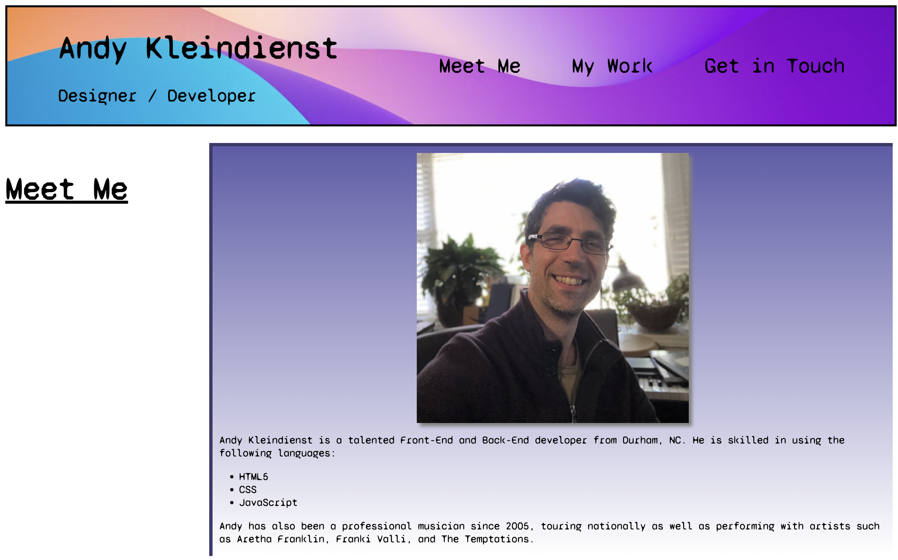

# Portfolio

## Project Intro

Every developer needs a place to showcase their talents and one of the best ways to do that is to create a website to host their work. The design of the website is a perfect introduction to the development skills of the programmer. 

## Project Goal
The goal of this project was to make a website for showcasing the design and production talents of Andy Kleindienst. Within the website there would be three main functional aspects:

1. Content: The name of the developer, a picture of the developer, and links to the sections about them, their work, and how to contact them.
2. Functionality: Navigation links that take you to a specific section when clicked on.
3. UI/UX Design: The design should be appealing and create an interactive user experience with changing colors, sizes, and positions when hovered over. 

## Portfolio Live Site Link
https://andykb9b13.github.io/Portfolio/

